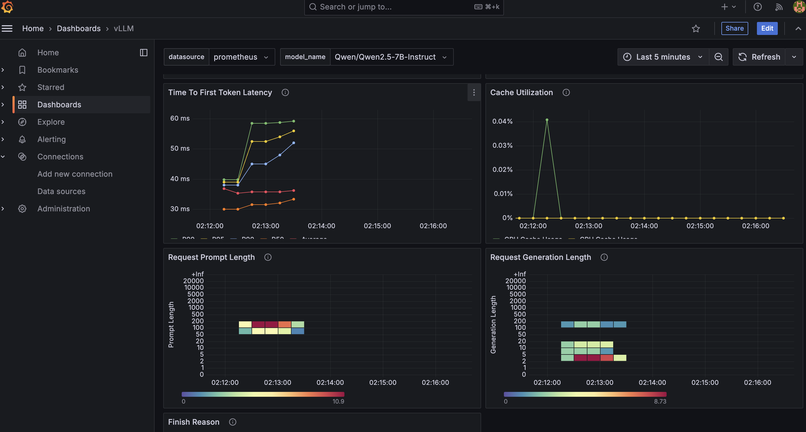

# vLLM 프로메테우스 & 그라파나 모니터링

vllm 을 서빙하면 `/metrics` endpoint 에서 지표들을 관찰 가능합니다.

```
# HELP vllm:num_requests_running Number of requests currently running on GPU.
# TYPE vllm:num_requests_running gauge
vllm:num_requests_running{model_name="meta-llama/Llama-3.1-8B-Instruct"} 0.0
# HELP vllm:num_requests_swapped Number of requests swapped to CPU.
# TYPE vllm:num_requests_swapped gauge
vllm:num_requests_swapped{model_name="meta-llama/Llama-3.1-8B-Instruct"} 0.0
# HELP vllm:num_requests_waiting Number of requests waiting to be processed.
# TYPE vllm:num_requests_waiting gauge
vllm:num_requests_waiting{model_name="meta-llama/Llama-3.1-8B-Instruct"} 0.0
# HELP vllm:gpu_cache_usage_perc GPU KV-cache usage. 1 means 100 percent usage.
# TYPE vllm:gpu_cache_usage_perc gauge
vllm:gpu_cache_usage_perc{model_name="meta-llama/Llama-3.1-8B-Instruct"} 0.0
# HELP vllm:cpu_cache_usage_perc CPU KV-cache usage. 1 means 100 percent usage.
# TYPE vllm:cpu_cache_usage_perc gauge
vllm:cpu_cache_usage_perc{model_name="meta-llama/Llama-3.1-8B-Instruct"} 0.0
# HELP vllm:cpu_prefix_cache_hit_rate CPU prefix cache block hit rate.
# TYPE vllm:cpu_prefix_cache_hit_rate gauge
vllm:cpu_prefix_cache_hit_rate{model_name="meta-llama/Llama-3.1-8B-Instruct"} -1.0
# HELP vllm:gpu_prefix_cache_hit_rate GPU prefix cache block hit rate.
# TYPE vllm:gpu_prefix_cache_hit_rate gauge
vllm:gpu_prefix_cache_hit_rate{model_name="meta-llama/Llama-3.1-8B-Instruct"} -1.0
# HELP vllm:avg_prompt_throughput_toks_per_s Average prefill throughput in tokens/s.
# TYPE vllm:avg_prompt_throughput_toks_per_s gauge
vllm:avg_prompt_throughput_toks_per_s{model_name="meta-llama/Llama-3.1-8B-Instruct"} 0.0
# HELP vllm:avg_generation_throughput_toks_per_s Average generation throughput in tokens/s.
# TYPE vllm:avg_generation_throughput_toks_per_s gauge
vllm:avg_generation_throughput_toks_per_s{model_name="meta-llama/Llama-3.1-8B-Instruct"} 0.0
# HELP vllm:cache_config_info Information of the LLMEngine CacheConfig
# TYPE vllm:cache_config_info gauge
vllm:cache_config_info{block_size="16",cache_dtype="auto",cpu_offload_gb="0",enable_prefix_caching="False",gpu_memory_utilization="0.9",num_cpu_blocks="2048",num_gpu_blocks="2375",num_gpu_blocks_override="None",sliding_window="None",swap_space_bytes="4294967296"} 1.0
# HELP vllm:num_preemptions_total Cumulative number of preemption from the engine.
# TYPE vllm:num_preemptions_total counter
vllm:num_preemptions_total{model_name="meta-llama/Llama-3.1-8B-Instruct"} 0.0
# HELP vllm:prompt_tokens_total Number of prefill tokens processed.
# TYPE vllm:prompt_tokens_total counter
vllm:prompt_tokens_total{model_name="meta-llama/Llama-3.1-8B-Instruct"} 0.0
# HELP vllm:generation_tokens_total Number of generation tokens processed.
# TYPE vllm:generation_tokens_total counter
vllm:generation_tokens_total{model_name="meta-llama/Llama-3.1-8B-Instruct"} 0.0
```

> 참고: vllm backend 를 사용하는 nvidia triton 컨테이너는 24.08 버전 부터 지원하니 참고하세요.


## Server Setup

위 지표는 Promethous 형식이라, k8s 에서 많이들 사용하는 grafana로 옮겨 대시보드를 모는 것이 매우 쉽습니다.

[vllm 공식 레포](https://github.com/vllm-project/vllm/tree/main/examples/production_monitoring)에서는 promethous & grafana 서빙을 위한 docker-compose.yaml 파일을 제공하기 떄문에 쉽게 셋업이 가능합니다.

모델을 서빙 한 후
```bash
vllm serve {MODEL} \
    --max-model-len 2048 \
    --disable-log-requests
```

도커로 서버를 올립니다.

```bash
docker compose up
```

이제 테스트를 날려주면 되는데, sharegpt 로 날리는 예시입니다, 실제 운영 상황에서는 유저들이 요청을 날리고 있겠죠.

```bash
wget https://huggingface.co/datasets/anon8231489123/ShareGPT_Vicuna_unfiltered/resolve/main/ShareGPT_V3_unfiltered_cleaned_split.json

python3 ../../benchmarks/benchmark_serving.py \
    --model mistralai/Mistral-7B-v0.1 \
    --tokenizer mistralai/Mistral-7B-v0.1 \
    --endpoint /v1/completions \
    --dataset-name sharegpt \
    --dataset-path ShareGPT_V3_unfiltered_cleaned_split.json \
    --request-rate 3.0
```

위와 같이  [`http://localhost:8000/metrics`](http://localhost:8000/metrics) 링크에서 prometheous 데이터를 볼 수 있고요.


## Grafana

Grafana 셋업을 해서 데이터를 연동, visualize 하겠습니다.

[`http://localhost:3000`](http://localhost:3000/)  로 들어가 기본 셋팅으로 로그인 합니다.   
username (`admin`), password (`admin`).

#### 프로메테우스 데이터 소스 연결


[`http://localhost:3000/connections/datasources/new`](http://localhost:3000/connections/datasources/new) 로 둘어가 프로메테우스를 선택해 데이터를 이어줍니다.  

 `Prometheus Server URL` 을 연결해줘야 하는데, 현재는 다른 컨테이너가 각자 두개 떠 있지만, 도커가 DNS를 연결해 주도록 셋업이 되어있습니다. 그냥 `http://prometheus:9090` 만 연결해주면 됩니다.

 `Save & Test`를 누르면,  "Successfully queried the Prometheus API." 라고 뜰 겁니다.


#### 대시보드 셋업

[`http://localhost:3000/dashboard/import`](http://localhost:3000/dashboard/import) 로 접속해서 `grafana.json` 파일을 업로드 해줍니다. `prometheus` 데이터 소스를 선택해주고요. 그러면 사전 셋업된 대시보드가 표시가 됩니다.


## Runpod 에서 연동 시켜보기


직접 docker 를 말기 전에, konuu/llm_ready:latest image 에서 metric 연동하는 작업을 해보겠습니다.
상황은 다음과 같습니다, 물론 이렇게 안 해도 됩니다. 서버의 위치는 원하는 대로 바꿀 수 있죠.
- runpod 에서 prometheous 를 올립니다.
- 다른 grafana 서버에서 모아서 보여줍니다.


1. Pod edit 해서 8888,8000,3000,9090 포트를 뚫어줍니다. (3000은 그라파나라서 다른 곳에 올릴 것이면 안뚫어줘도 됩니다.)

2. vllm 을 켜줍니다.
```bash
vllm serve Qwen/Qwen2.5-7B-Instruct
```

3. prometheus 를 설치합니다.
```bash
wget https://github.com/prometheus/prometheus/releases/download/v2.53.2/prometheus-2.53.2.linux-amd64.tar.gz
tar -xvzf ./pro...tar.gz
```

4. vllm repo 에서 prometheous.yml 을 받아서 켜줍니다.
- https://github.com/vllm-project/vllm/blob/main/examples/production_monitoring/prometheus.yaml

```bash
cat <<EOF > prometheus.yaml
# prometheus.yaml
global:
  scrape_interval: 5s
  evaluation_interval: 30s

scrape_configs:
  - job_name: vllm
    static_configs:
      - targets:
          - 'localhost:8000'
EOF
```


```bash
./prometheus --config.file=prometheus.yaml
```


5. 다른 곳 어딘가에서 grafana를 키고 연결을 해줍시다.

ex) https://l3wuat7zoyx44d-9090.proxy.runpod.net/

그리고 일을 하면 모니터링이 가능합니다.

