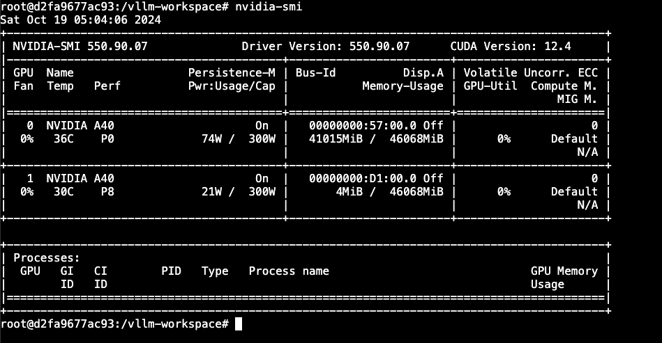

요즘의 LLM 은 필연적으로 멀티 GPU 혹은 멀티 노드 로 확장된 Inference 가 필요하죠.   
GPU는 하나의 LLM 을 돌려주기에 메모리가 모자르니까요.   

## Multi - GPU

한 노드에 여러 GPU 가 여러개 꼽혀있는 경우입니다.   
사실 이 경우는 매우 쉬워요. 그냥 옵션만 주면 됩니다.  

```python
from vllm import LLM
llm = LLM("meta-llama/Llama-3.1-8B", tensor_parallel_size=4)
output = llm.generate("San Franciso is a")
```

```bash
vllm serve meta-llama/Llama-3.1-8B \
    --tensor-parallel-size 4
```

파이선 또는 shell 커맨드로 위와 같이 주면  끝입니다. 참 쉽죠?  

여기서 다른 옵션이 하나더 있는데요.  `pipeline parallelism` 입니다.  
병렬 단계를 텐서레벨에서 주는 것이 아니라 레이어 레벨에서 주는 것입니다.  
[Tensor parallelism vs Pipeline Parallelim](https://colossalai.org/docs/concepts/paradigms_of_parallelism/) 에 대한 자세한 내용은 달려있는 링크를 참조하시면 됩니다.  

예를 들어 한 노드에 현재 gpu 가 8개 있다고 해 봅시다.  
그러면 아래와 같이 하는 방법도 있습니다.  

```bash
vllm serve meta-llama/Llama-3.1-8B \
    --tensor-parallel-size 4 \
    --pipeline-parallel-size 2
```

이렇게 run 을 해주면 하나의 matrix 의 연산에 대해서는 4개의 gpu를 쓰고, Layer가 넘어가면 다음 4개의 gpu 를 사용하니까, gpu 같의 통신 로직이 필요한 경우가 줄겠죠. 대신, 연속된 task 가 없다면 노는 gpu 들이 생길 것 입니다. 일반적으로는 high throughput 을 달성 할 수 있을 텐데, 모델 따라 input token 따라 차이가 있을테니 확정적인 것은 아닙니다. 

### 직접 돌려보기!

A40 (48GB) x2 를 대여하겠습니다.  
대여는 runpod 에서 했고요, 서비스 이름에서 알수 있듯  `konuu/llm_ready:latest` docker image 를 올려 줍니다.  vllm image 를 안 올린 이유는, model을 처음부터 같이 띄워주는게 싫어서 입니다.

> (참고) RTX3090 (24GB) x 4 를 먼저 대여했는데 에러가 나서 안뜨는 군요... ;;

 개인적으로는 container 가 올라간 것이 아니라 하드웨어를 빌려주는 LambdaLabs 를 선호하는데, 요즘 GPU 가 동나서... 빌리기가 힘드네요.
 



서빙을 한번 해보죠, 환경변수 셋업을 한번 합니다.  meta-llama 는 허깅페이스에서 권한을 받아야만 사용이 가능하니, 미리 승인을 받아두시고 huggingface token을 등록합니다. 

``` bash
export HF_TOKEN=HF-TOKEN
```

이제 vLLM 서빙을 시작합니다. 48 기가에 올라가지는 못할 32B 모델을 올려보겠습니다.

```bash
vllm serve Qwen/Qwen2.5-32B-Instruct
```

예상한대로 OutOfMemory 에러가 발생합니다 !!!

```
torch.OutOfMemoryError: CUDA out of memory. Tried to allocate 270.00 MiB. GPU 0 has a total capacity of 44.34 GiB of which 142.81 MiB is free....
```


2개의 GPU를 동시에 쓰기 위해서 tensor parallel 옵션을 추가하겠습니다.

```bash
vllm serve Qwen/Qwen2.5-32B-Instruct --tensor-parallel-size 2
```

이번엔 에러가 없이 서빙이 됩니다.


Runpod ID 로 serving 이 되고 있는지 날려봅니다, 32k 입력을 받는 Qwen2.5-32B-Instruct 이 서빙 되고 있군요. 

```bash
❯ curl https://36g54goiy09px8-8000.proxy.runpod.net/v1/models

{"object":"list","data":[{"id":"Qwen/Qwen2.5-32B-Instruct","object":"model","created":1729343280,"owned_by":"vllm","root":"Qwen/Qwen2.5-32B-Instruct","parent":null,"max_model_len":32768,"permission":[{"id":"modelperm-7eef3c565e63464d83e0ac30fb235dc0","object":"model_permission","created":1729343280,"allow_create_engine":false,"allow_sampling":true,"allow_logprobs":true,"allow_search_indices":false,"allow_view":true,"allow_fine_tuning":false,"organization":"*","group":null,"is_blocking":false}]}]}%   
```


OpenAI compatible 한 서버니, chat completion api 를 호출합니다. 대답 토큰이 날라옵니다 !!

```bash
❯ curl https://36g54goiy09px8-8000.proxy.runpod.net/v1/chat/completions \
  -H "Content-Type: application/json" \
  -H "Authorization: Bearer $API_KEY" \
  -d '{
    "model": "Qwen/Qwen2.5-32B-Instruct",
    "messages": [
      {
        "role": "system",
        "content": "You are a helpful assistant."
      },
      {
        "role": "user",
        "content": "Hello!"
      }
    ]
  }'

{"id":"chat-20d3a3be6faf42c89dc9dbff5c1c5f01","object":"chat.completion","created":1729343397,"model":"Qwen/Qwen2.5-32B-Instruct","choices":[{"index":0,"message":{"role":"assistant","content":"Hello! How can I assist you today?","tool_calls":[]},"logprobs":null,"finish_reason":"stop","stop_reason":null}],"usage":{"prompt_tokens":21,"total_tokens":31,"completion_tokens":10},"prompt_logprobs":null}%  
```


