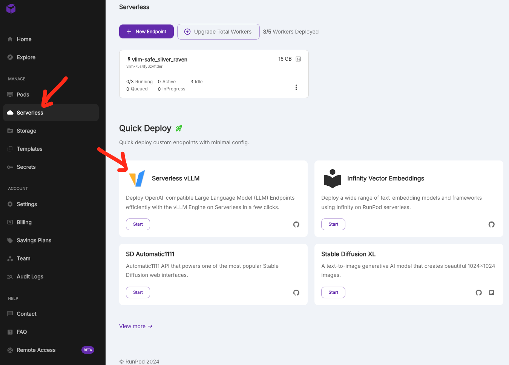
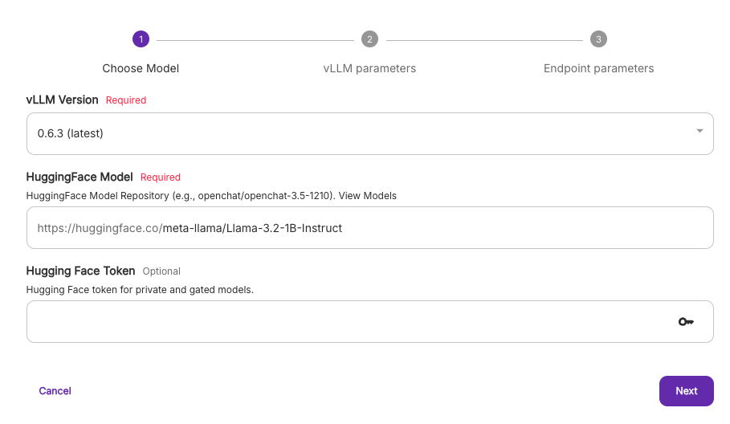
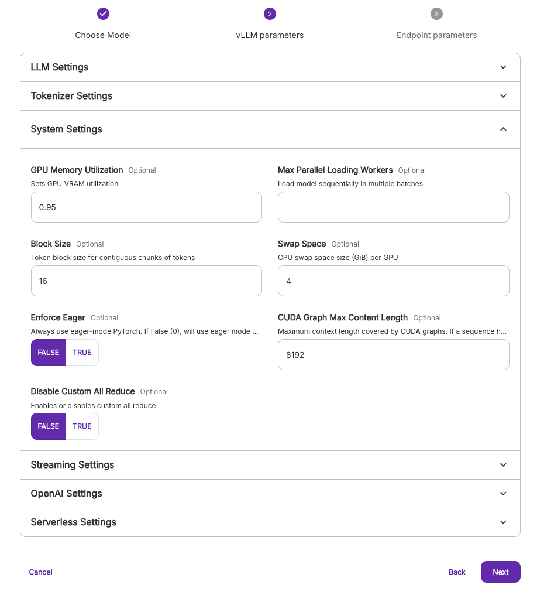
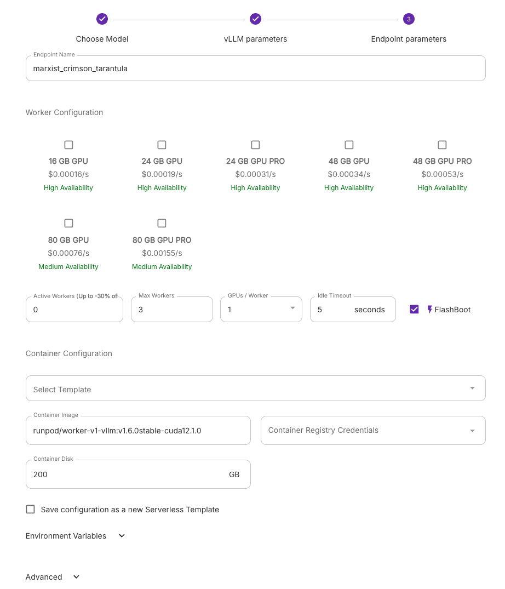
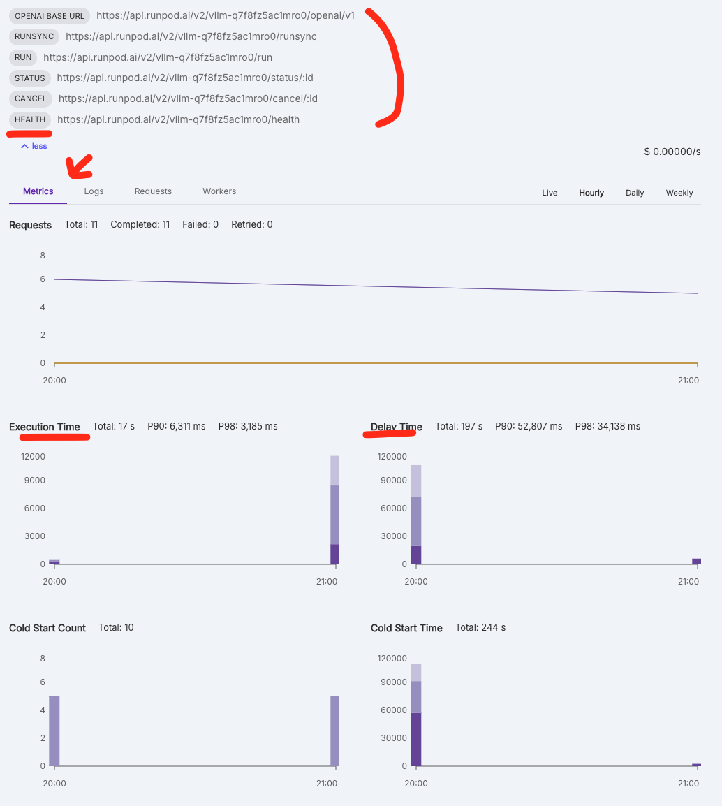

Runpod 은 GPU pod을 대여해주기도 하지만, Serveless 옵션도 제공합니다.
아주 쉽게 ondemand LLM 서비스를 돌릴 수 있습니다.

참조 - https://github.com/runpod-workers/worker-vllm




vLLM 이 아닌 Stable Diffusion 이나 임베딩, (캡처에는 빠졌지만) whisper 도 호스팅이 가능합니다.

아래와 같은 설정창들을 지나고 나면 인스턴스가 생기게 됩니다.

1. Model 과 vLLM 설정. 권한이 필요하다면, HF token 까지 설정해주면 됩니다.



2. 두번째는 vLLM 설정입니다. 아주 아주 많은 셋팅 요소들이 있는데, vLLM engine의 argument 들입니다. 
   자세한 내용은 [QuickStart](./QuickstartonRunPod) 페이지를 보시면 CLI 상에서의 설명이 있습니다. 이와 똑같은 옵션들이 거의 그대로 UI 로 구성 된 것이니 필요에 맞게 값들을 입력해주면 됩니다. 

- vLLM 이 아닌 serverlss setting 란이 더 있는데, 로깅이랑 얼마나 동시 입력을 처리할 것인가에 대한 설정입니다.




3. 마지막은 GPU 설정을 하는데, 메모리를 기준으로 지정되어있습니다. 메모리가 곧 올릴 수 있는 모델을 결정하니 이렇게 만들었나 봅니다. 같은 16기가 GPU 여도 여러가지 GPU 가 있을 수 있는데, 알아서 남는 자원 보고 띄워줍니다.




이렇게 설정을 하고 나면 endpoint 가 생성됩니다. 
요청을 한번 날려보겠습니다. 

```bash 
curl -X POST https://api.runpod.ai/v2/{endpoint_id}/runsync \
    -H 'Content-Type: application/json' \
    -H 'Authorization: Bearer ${API_KEY}' \
    -d '{"input": {"prompt": "오늘 저녁 메뉴 추천 좀..!"}}'
```

```
{"delayTime":6074,"executionTime":257,"id":"sync-8716c00d-783a-4698-a6a1-9f7eeb9a1150-e1","output":[{"choices":[{"tokens":[" 오LCETOHex를 قر�니.._production 중에\toLCET"]}],"usage":{"input":11,"output":16}}],"status":"COMPLETED","workerId":"4lff10gwwrz14w"} 
```

라고 답변이 오는군요. serving 하는 모델이 `meta-llama/Llama-3.2-1B-Instruct` 라서 어리버리 대답을 했군요.


이번엔 serverless 모델도 3.1-8B 모델로 바꿔주고, openai compatible 한 chat/completions API endpoint 로 날려보겠습니다.

```bash
curl "https://api.runpod.ai/v2/vllm-q7f8fz5ac1mro0/openai/v1/chat/completions" \
    -H "Content-Type: application/json" \
    -H "Authorization: Bearer {API_KEY}" \
    -d '{
        "model": "meta-llama/Llama-3.1-8B-Instruct",
        "messages": [
            {
                "role": "system",
                "content": "You are a helpful assistant."
            },
            {
                "role": "user",
                "content": "오늘 저녁 메뉴 추천 좀..!"
            }
        ]
    }'
```

```
{"choices":[{"finish_reason":"stop","index":0,"logprobs":null,"message":{"content":"오늘 저녁 메뉴를 추천해 드릴게요!\n\n1.  **갈비탕**: 한복판에 대표적인 음식 중 하나인 갈비탕은 기름 진 갈비와 함께 끓여낸 국물로 가득한 음식입니다. 갈비와 국물이 함께하는 맛있는 음식이요!\n2.  **불고기**: 소고기หร�거나 쇠고기를 통째로 불고기반에 간장, 설탕, bàn muối 등으로 조리하여熟련된 맛을 내는 음식입니다.\n3.  **불닭갈비**: 갈비를 불닭장과 섞어간 후에 불려낸 국물에ใส워서 국물이 가득한 음식입니다.\n4.  **치킨**: 치킨은 미국에서 유래된 음식으로 기름에 튀겨낸 닭 고기를 의미합니다. 간혹 치킨의 요리법은 맛을 내는 부분을 말씀드리자면, 기름에 튀겨낸 후에 마늘과 후추, 생강 등과 함께 간장을 뿌려 그 맛을 내는 음식입니다.\n5.  **해물파스타**: 해물파스타는 파스타에 해물찌개를 얹어 집에만 있는 해물찌개의 맛을 내는 음식입니다. 해물찌개의 맛을 내는 해물찌개는 해물찌개에 해물찌개를 꼭 넣어서 끓여낸 후에 파스타에 얹어 주는 음식입니다.\n\n위의 메뉴 중 하나로 선택해 주시면 좋을 것 같습니다.","role":"assistant","tool_calls":[]},"stop_reason":null}],"created":1729425952,"id":"chat-3fecdfddffe041fd8a0c33b701a3d3f9","model":"meta-llama/Llama-3.1-8B-Instruct","object":"chat.completion","prompt_logprobs":null,"usage":{"completion_tokens":357,"prompt_tokens":51,"total_tokens":408}}
```

이렇게 답변이 왔군요 ...!


아래와 같이
- API endpoint 들, 현재 inference 양에 따라 차징되는 금액
- 실시간으로 worker들이 올라갔다 내려갔다, 로그와 함께 metrics 들을 볼 수 있습니다.




UI 상 제공하는 내용들이 사실 훨씬 많은데, 영상 형태여야 잘 보일 수 있겠더군요.

요약하자면,
- 누구나 Open된 모델을 원클릭으로 돌릴 수 있습니다.
- 심지어 On-Demand 로 돌고요,
- 어느 정도 Auto-Scaling 도 됩니다.
- OpenAI Compatible 해서 호환성도 좋습니다.

첨언 조금만 하자면
미쳤네요 그냥. LambdaLabs 에 GPU 가 동나서 runpod으로 이사왔는데, 너무 많은 것들이 쉽게 됩니다.