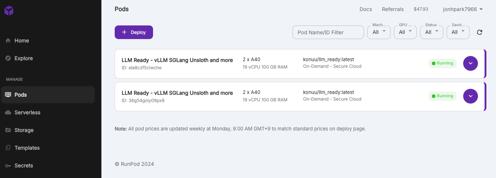

##  Multi - Node

이번엔 더 큰 모델을 돌리고 싶어요. 70B 모델을 올려보겠습니다.

```bash
vllm serve meta-llama/Llama-3.1-70B-Instruct --tensor-parallel-size 2
```

역시 OutOfMemory 가 발생합니다.

```
torch.OutOfMemoryError: CUDA out of memory. Tried to allocate 224.00 MiB. GPU 0 has a total capacity of 44.34 GiB of which 64.81 MiB is free....
```

멀티 노드로 확장을 해야합니다.
(사실 70B 모델은 GPU를 그냥 많이 달아도 되긴 하지만 멀티 노드 테스트를 위한 실습입니다)
2개의 컨테이너를 띄워 줍니다. 




2개의 도커 이미지를 연결할 것인데, host 와 worker 를 모아서 클러스터를 구성해야합니다. vllm cluster는 [run_cluster.sh](https://github.com/vllm-project/vllm/blob/main/examples/run_cluster.sh) 스크립트를 참조해서 ray 로 구성했습니다. 

LambdaLabs 도 그렇고, RunPod 도 그렇고, 클러스터 host를 안쪽에 두면 워커노드들이 접속하기가 어려워요. Firewall 설정이 조금 복잡합니다. 그래서 host는 확실하게 public ip 로 제가 다 네트워크 컨트롤 권한을 가진 홈서버로 진행했습니다. 

버전 호환을 위해 홈서버에 똑같이 도커 이미지를 올려줍니다.
(버전이 조금만 달라도 클러스터 구성이 잘 안됩니다.)

```bash
docker run -it -p 6379:6379 konuu/llm_ready:latest /bin/bash
```

그리고, 호스트가 될 노드를 켜줍니다. 

```bash
ray start --block --head --port=6379
```


RunPod 에서 띄운 두 개의 GPU pod 들에서 host 로 연결 해줍니다. 
```bash
ray start --block --address='jonhpark.iptime.org:6379'
```

그리고, `ray status` 를 찍어보면 잘 연결이 되었는지 볼 수 있습니다.

```
root@b9aa63cc7a54:/# ray status
======== Autoscaler status: 2024-10-19 16:55:27.171800 ========
Node status
---------------------------------------------------------------
Active:
 1 node_f7f6fb1cc9bc0458714ac8368cee8da2191feebd5701ca46ba920903
 1 node_7af94f3b6d67a3c0477ec12a39970f8dd3cb0b9527db400a9ce044a0
 1 node_b818e9149e8de461e242348ad7bc98a0f8ea91cf1854132061590284
Pending:
 (no pending nodes)
Recent failures:
 (no failures)

Resources
---------------------------------------------------------------
Usage:
 0.0/36.0 CPU
 0.0/4.0 GPU
 0B/134.45GiB memory
 0B/57.94GiB object_store_memory

```


그런데, 자꾸 금방 죽어서 불안하네요. 아무래도 1CC 가 필요한데, 1주일씩 reserve 를 해야하기 떄문에, lambda labs 기준 12000 달러가 필요합니다... ㅠㅠ 


# SkyPilot


```
# for MACOS 
# pip uninstall grpcio; conda install -c conda-forge grpcio=1.43.0


conda create -y -n sky python=3.10
conda activate sky

pip install "skypilot[runpod]"
```


runpod 기준

api key 발급 후

pip install "runpod>=1.5.1"
runpod config

